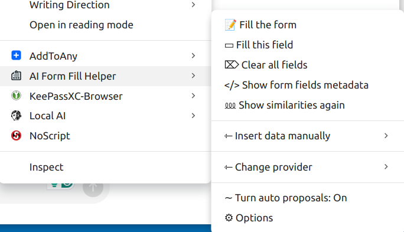

# AIWebFormFill

This is a small project aimed to facilitate filling web forms. There may be situations (like filling applications during your job search 😉) where one need repetitevely fill the same information again and again, like ordering food or goods. There is where this helper was born.

No doubt there are a lot of well sophisticated tools and solutions out there that may satisfy a great range of needs.

This one is a bit different. It was created with the privacy in mind. That means that the data you're using stays locally and is neither shared nor stored outside your machine. What fields will be filled by this tool is completely up to you.

But still a word of caution - avoid storing sensitive information like cards, passwords, etc., because any flaw in the browser security may put in risk your data.

## Usage
Installing this extension will add a few lines as a context menu and you'll be able to use it from there. In those menus are also the setting where you have to define the values you'd like to use filling a form.

## Installation
Download and install the extension for the Chrome Web Store
**Note:** Reload the page if you need it on the current page
Right click on a form field and you see somewhere the main context menu


### SubMenus

* Show form field metadata
This menu will show the `id`s and `name`s for the fields that are considered as suitable to be filled.


# Options


## Form data
```
{
    "address1": "Some Ave",
    "country": "The Country",
    "email": "JohnDow@mail.com",
    "firstName": "John",
    "fullName": "John Dow",
    "lastName": "Dow",
    "tel": "123456789",
    "town": "The City"
}
```

# In Action


