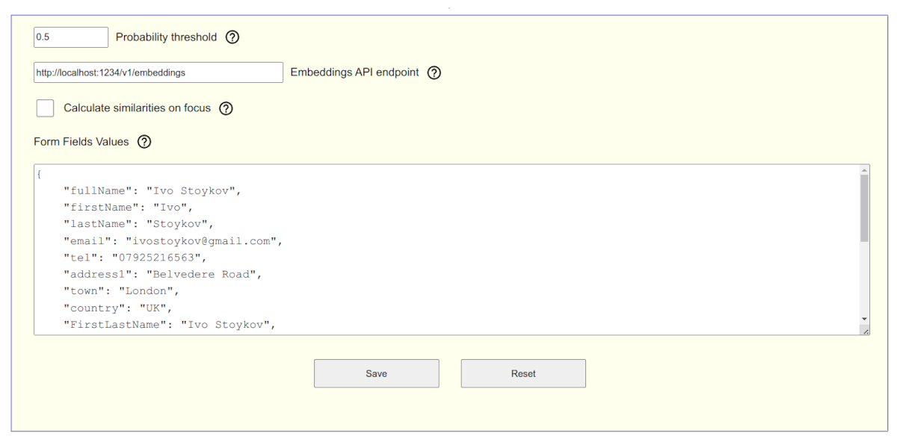

# AIWebFormFill

This is a small project aimed at facilitating the filling of web forms. There may be situations, such as filling out applications during your job search 😉, where you need to repeatedly fill in the same information again and again, like ordering food or goods. It's there that this helper was born.

No doubt, there are many well-sophisticated tools and solutions out there that may satisfy a wide range of needs.

This one is different. It was created with privacy in mind. That means that the data you use stays locally on your machine and is neither shared nor stored outside it. What fields will be filled by this tool is entirely up to you.

However, I must issue a word of caution: avoid storing sensitive information like credit cards, passwords, etc., as any flaw in browser security may put your data at risk.

---

## Pre-requisits
This extension works with a local AI. This means that you need AI installed. Also, it requires a local POST API endpoint to communicate with. You could use any tool at your convenience. Here I'll explain my preferable environment settings.

### API server
Probably the easier way to make all work is to use [LM Studio](https://lmstudio.ai/) (Ctrl+click to open in a new tab). Download and set it for your OS.
This extension uses embedding endpoint so it doesn't require great resources.

Once LM Studio is set, download a MiniLM gulf (ie All-MiniLM-L6-v2-Embedding-GGUF). You need to search for it from within LM Studio and download it from there. Once on your machine, it will appear in the embeddings model list, where you have to activate it. And you're done; you're ready to fill out some other form.


**Note:** For the moment it is expected LM Studio to use the default http port - 1234.

---

## Installation
Download and install the extension from the Chrome Web Store. Alternatively clone this repo and install it in Developer mode, you should know how if you take this path.

**Note:** Reload the page if you need to use it immediately on current tab.

## Usage
Installing this extension will add a few lines to the context menu, and you'll be able to use it from there. Included in these menus are settings where you must define the values you wish to use by filling out a form.

Right-click on a form field and you will see the main context menu.


### SubMenus


* _Show form field metadata_

This menu will show the `id`s and `name`s for the fields that are considered as suitable to be filled.


It's helpful to know which fields are good for filling out. The extension will also show why a field might not get filled—usually, it's because there's a poor match between the field's metadata and the info you've provided. This can give you a clue about what extra details to include in the options.

To fill a form properly you have to provide some data, haven't you? This is what the next section is for.

# Options


## Form data

Below is an example data and the format it is expected to be. Note that left and right parts are in quotes. (I know you know but to be sure).

You can add, change, or manipulate this data in any way that serves your needs best. If you want to remove it, replace it with `{}` and save.

```
{
    "address1": "Some Ave",
    "country": "The Country",
    "email": "JohnDow@mail.com",
    "firstName": "John",
    "fullName": "John Dow",
    "lastName": "Dow",
    "tel": "123456789",
    "town": "The City"
}
```

# In Action


