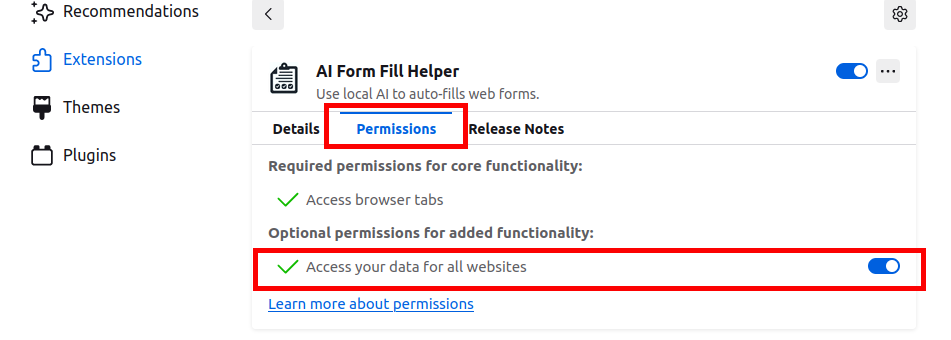
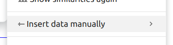
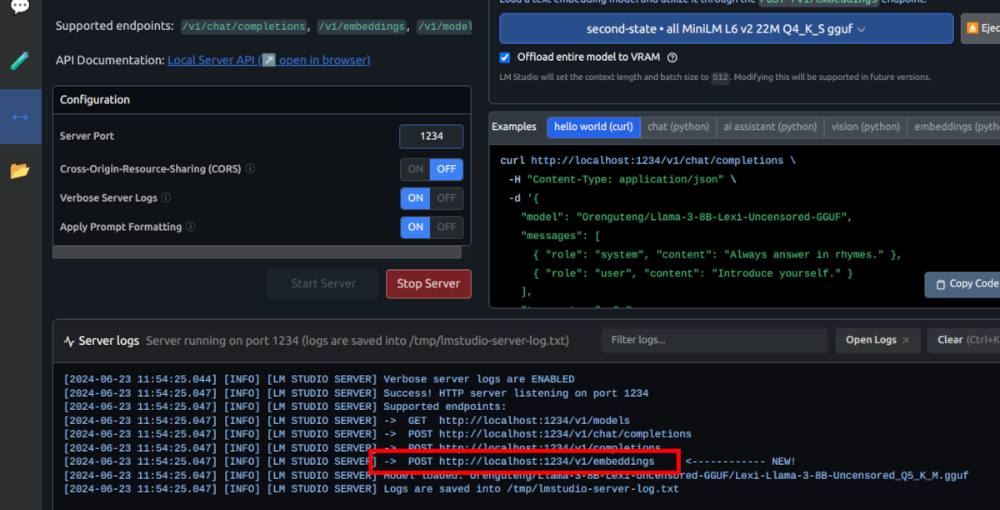

# AI Web Form Fill Helper

<p align="center">
  
</p>


This is a small project aimed at facilitating the filling of web forms. There may be situations, such as filling out applications during your job search 😉, where you need to repeatedly fill in the same information again and again, like ordering food or goods. It's there that this helper was born.

No doubt, there are many well-sophisticated tools and solutions out there that may satisfy a wide range of needs.

This one is different. It was created with privacy in mind. That means that the data you use stays locally on your machine and is neither shared nor stored outside it. What fields will be filled by this tool is entirely up to you.

### And the best part - it is free, [FOSS](https://en.wikipedia.org/wiki/Free_and_open-source_software), and will remain such.

However, I must issue a word of caution: avoid storing sensitive information like credit cards, passwords, etc., as any flaw in browser security may put your data at risk.

#### Download Links
||||
|------|------|------|
|  | Get Firefox addon | [here](https://addons.mozilla.org/en-US/firefox/addon/ai-form-fill-helper/) |
|  | For Chrome extension | [here](https://chromewebstore.google.com/detail/ai-form-fill-helper/hfcoicpedjbfhfiaamajpnaabjdkhjcj) |

# Firefox Permission Note



The latest Firefox require explicit user permision to access data. To enable this permission on you need to open burger menu (`≡`) and from there find and click `Add-ons and themes`. Locate the `AI Form Fill Helper` extension and click on the name. The middle tab is `Permissions` - click to open. Enable the `Access your data for all websites` option. Refresh the page if you had it open prior to making this change. The screenshot above shows where it is located.


### What this project is NOT

This is not a form hacking tool, nor is it intended to be. Its purpose is solely to enhance user experience by eliminating mundane, repetitive tasks. Responsibility for proper usage rests with the user.

### The Forms

Web forms are often targets of various attacks, from spammers to hackers. This leads to a constant cycle of updated attacks and defenses. Therefore, one might find forms that do not accept, block, or otherwise prevent this tool from working, and this is normal. If you encounter such issues, [report it here](https://github.com/ivostoykov/AIWebFormFill/issues)

---

The latest changes are available [here](CHANGELOG.md)

---

## Pre-requisits
This extension works with a local AI. This means that you need AI installed. Also, it requires a local POST API endpoint to communicate with. You could use any tool at your convenience. Here I'll explain my preferable environment settings.

### API server
Probably the easier way to make all work is to use [LM Studio](https://lmstudio.ai/) (Ctrl+click to open in a new tab). Download and set it for your OS.
This extension uses embeddings endpoint so it doesn't require great resources.

Once LM Studio is set, download a MiniLM gulf (ie All-MiniLM-L6-v2-Embedding-GGUF). You need to search for it from within LM Studio and download it from there. Once on your machine, it will appear in the embeddings model list, where you have to activate it. And you're done; you're ready to fill out some other form.


---

## Installation
Install the extension from the [Download Links](#download-links) section. Alternatively clone this repo and install it in Developer mode, you should know how, if you take this path.

**Note:** Reload the page if you need to use it immediately on current tab.

## Usage


If `Calculate similarities on focus` (see [Options](#options) below) is enabled, then you'll see this action:


To quickly fill a single field, use the shortcut key combination `Ctrl+Shift+Left Arrow` or `Ctrl+Shift+Right Arrow`.

To fill the entire form at once, press `Ctrl+Shift+Enter`.

Installing this extension will add a context menu, and you'll be able to use it from there. `Options` are also accessible from the context menu where you must define the values you wish to use by filling out a form. (see [Options](#options))

Right-click on a form field and you will see the main context menu.


---

### SubMenus


Top three menus are self-explanatory, I believe.

* _Show form field metadata_

This menu will show the `id`s and `name`s for the fields that are considered as suitable to be filled.


It's helpful to know which fields are good for filling out. The extension will also show why a field might not get filled—usually, it's because there's a poor match between the field's metadata and the info you've provided. This can give you a clue about what extra details to include in the options.

To fill a form properly, you have to provide some data, don't you? This is what the last menu and the next section are for.

### Turn auto proposal On/Off


*Note:* This will turn it `on` or `off` only until the page is changed or reloaded.
To make the change permenant use the [Options](#options) page.

### Insert data manually


The [Form data](#form-data) values will be listed in this submenu, allowing to bypass the proposal and insert the value directly in the element having the focus.

# Options


Use circled question marks for a quick help or ask a quesion [here](https://github.com/ivostoykov/AIWebFormFill/issues).

## Embeddings endpoint API
In LM Studion the full URL is given in the server log:



For other tools, like Ollama, please check their documentation.

## Form data

Below is an example data and the format it is expected to be. Note that left and right parts are in quotes. (I know you know but to be sure).

You can add, change, or manipulate this data in any way that serves your needs best. If you want to remove it, replace it with `{}` and save.

```
{
    "address1": "Some Ave",
    "country": "The Country",
    "email": "JohnDow@mail.com",
    "firstName": "John",
    "fullName": "John Dow",
    "lastName": "Dow",
    "tel": "123456789",
    "town": "The City"
}
```

### Notes about the data

There is no standard for naming fields, which can complicate the entry of appropriate values. What appears on the screen might not always be the input field typically used. It might be useful to duplicate some values. For instance, you might encounter labels like 'Fill Name' or 'First & Last Name', among others. If these fields are not correctly filled, consider adding them to the options like this:

```
    "fullName": "John Dow",
    "FirstLastName": "John Dow",
```


# In Action


